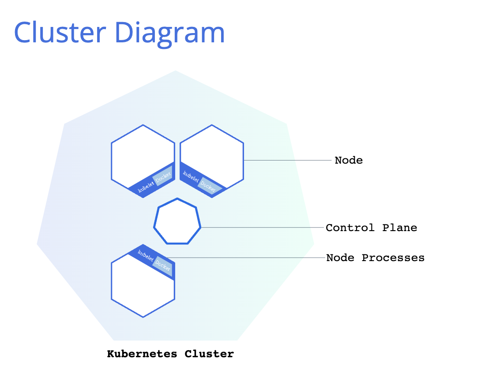
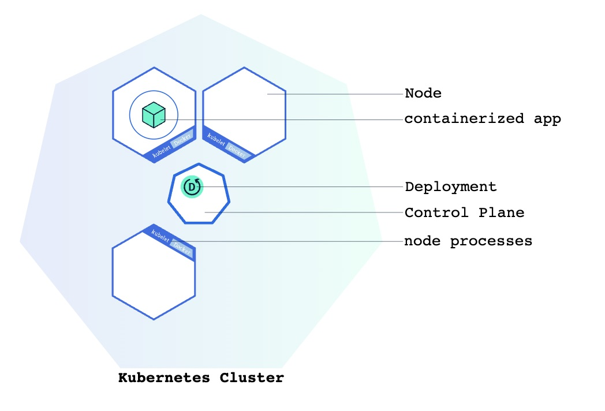
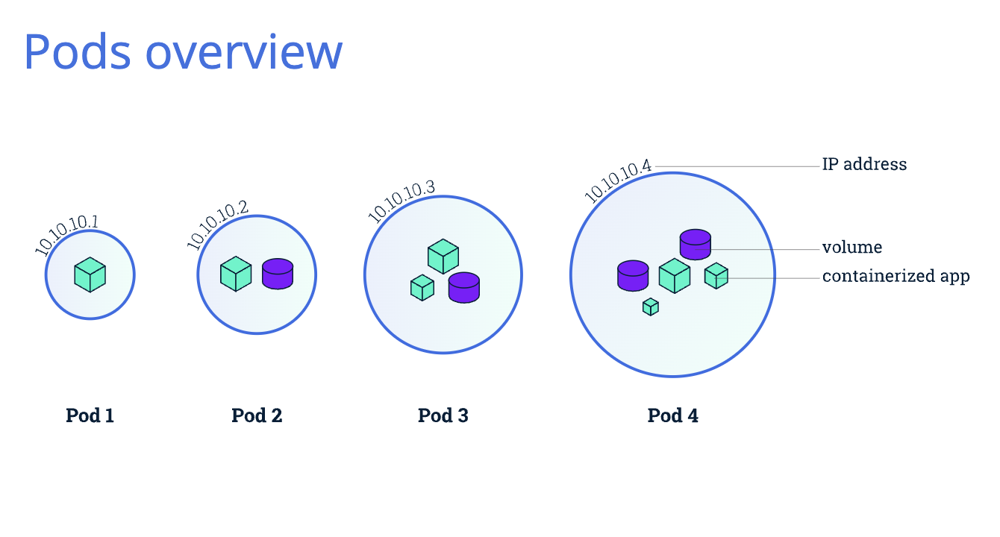
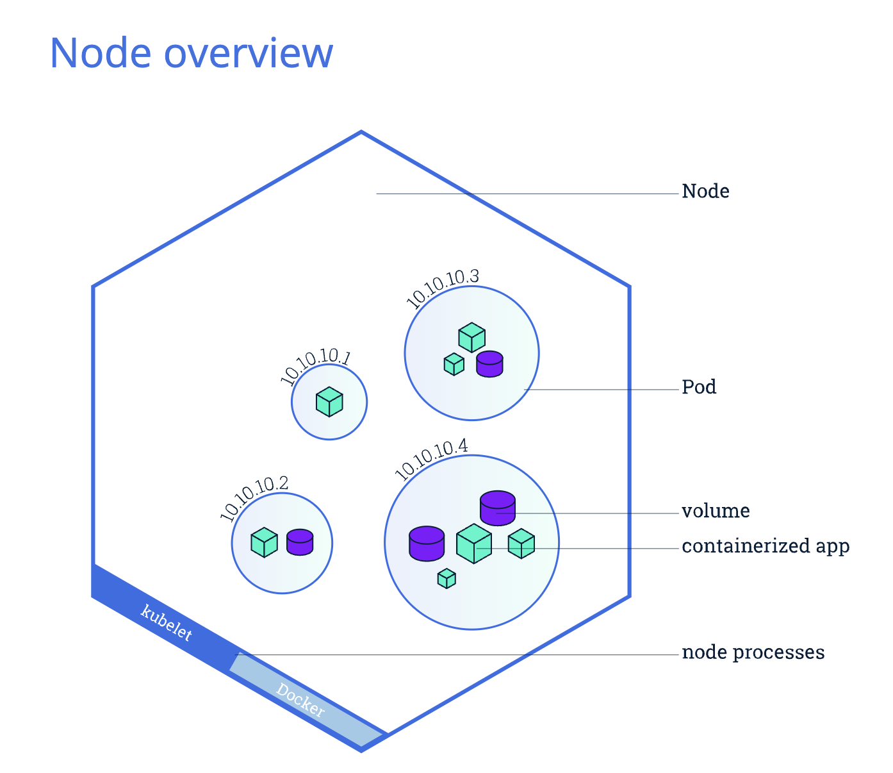

# Kubernetes Notes

## Table of Contents
1. [Introduction](#introduction)
2. [Basic Concept](#basic-concept)
3. [Architecture](#architecture)
4. [Components](#components)
5. [Setup and Installation](#setup-and-installation)
6. [Basic Commands](#basic-commands)
7. [Advanced Topics](#advanced-topics)
8. [Troubleshooting](#troubleshooting)
9. [Resources](#resources)

## Introduction
### 網站教學
- [Kubernetes Documentation](https://kubernetes.io/docs/)
- [Kubernetes 教學](https://kubernetes.io/docs/tutorials/)

## Basic Concept
### Kubernetes Cluster
[官網文件](https://kubernetes.io/docs/tutorials/kubernetes-basics/create-cluster/cluster-intro/)
- Kubernetes 使 deploy containerized applications 更容易，以前要一個個 container 安裝到各自的 machine 上面， k8s 使我們可以一次管理 cluster of pods。
  > **Kubernetes automates the distribution and scheduling of application containers across a cluster in a more efficient way.
- Kubernetes 由兩個部分組成
  > Control Planes manage the cluster and the nodes that are used to host the running applications.
  1. **Control Plane** 負責 coordinates cluster
  2. **Nodes** 是 worker, 執行 applications
    - 可能是 VM 或是 pysical computer
    - **Kubelet**
      - 每個 node 都有
      - 負責管理 node, 並負責跟 control plane 溝通

  
- 我們使用 [Kubernetes API](https://kubernetes.io/docs/concepts/overview/kubernetes-api/) 來與 control plane 做互動

### Deployment
當我們有正在 running 的 cluster, 我們就可以使用 **Deployment** deploy containerized application.
當我們 create **Deployment** 之後, Kubernetes 的 control plane 會控制執行這些 application 的 nodes. 提供 **self-healing mechanism**, 恢復 failure 的 nodes

### Pods and Nodes
#### Pods
  - **Pod**
    > A Pod is a group of one or more application containers (such as Docker) and includes shared storage (volumes), IP address and information about how to run them.
    - Pod host 我們給他們的 application
    - 一個 **Pod** 可以包含一個或多個 container, 例如 Node.js app + Node.js webserver
    - Pod 內的 containers 共享些資源
        - Shared storage, as **Volumes**
        - Networking, as a **unique cluster IP address**
        - Information about how to run each container, such as the container image version or specific ports to use
    - 同個 pod 內的 container 共享同個 IP address 跟 port space
    - 一個 pod 是 **atomic unit**, 最小單位，不可再分割
    - 一個 pod 會被 scheduled 到一個 available 的 node 上面，直到 node terminated or failure. 如果是 node failure, pod 會被 scheduled 到另一個可供使用的 node
  
  

### Nodes
- **Node**
    > A node is a worker machine in Kubernetes and may be a VM or physical machine, depending on the cluster. Multiple Pods can run on one Node.
    - 可以是 一個 VM 或是 一台 physical machine
    - 一個 Node 可以含有多個 Pods
    - 一個 Node 受 **Control Plane** 所控制
    - 每個 Node 都有 **Kubelet** ，負責跟 control plane 溝通，以及管理 Node 中的 Pods 以及 Containers
    - **Container Runtime**, 負責 pull container(docker) image, 跟 runnint the application.
    > Containers should only be scheduled together in a single Pod if they are tightly coupled and need to share resources such as disk.

     
### Services
 - **Service**
   - service 把 pod 的 ip expose 給 cluster 外部。
   - 負責 load balancing
   - 利用 **label selctor** 來決定 service 對應到的 pod
   - **Type**: 建立時，利用 spec 中的 `type` 決定 service 的種類
     - ClusterIP (default)
       - service 只被 cluster 內部存取
     - ＮodePort
       - Service 可被外部 access
     - LoadBalancer
       - Creates an external load balancer in the current cloud (if supported) and assigns a fixed, external IP to the Service. Superset of NodePort.
     - ExternalName
       - Maps the Service to the contents of the `externalName` field (e.g. foo.bar.example.com), by returning a `CNAME` record with its value. No proxying of any kind is set up. This type requires v1.7 or higher of kube-dns, or CoreDNS version 0.0.8 or higher.
  
   

### Scale
scale 原有的 deployment，例如原本 replica = 1, 執行後可以 = 4

範例指令: 1 -> 4
```bash
kubectl scale deployments/kubernetes-bootcamp --replicas=4
```
### Rolling Update
> Rolling updates allow Deployments' update to take place with zero downtime by incrementally updating Pods instances with new ones.
- Rolling Update 可以
  - 更新並確保 application 可以一直維持 uptime
  - 一個個更新 replica pods
    - 把新的 pod 放到 available node
    - 等新的 pod 成功開始運作時才把舊的刪掉
  - roll back 回舊的 version
  - CICD app with zero downtime
    
  > If a Deployment is exposed publicly, the Service will load-balance the traffic only to available Pods during the update.
  
  範例： rolling update, 更新，成功後關閉舊的 pod
  ```sql
    NAME                                   READY   STATUS        RESTARTS      AGE
  hello-minikube-7d48979fd6-q274b        1/1     Running       0             24h
  kubernetes-bootcamp-68cfbdbb99-5986c   1/1     Terminating   4 (17h ago)   23h
  kubernetes-bootcamp-68cfbdbb99-qcz98   1/1     Terminating   0             33m
  kubernetes-bootcamp-77596488f6-4vbsk   1/1     Running       0             11s
  kubernetes-bootcamp-77596488f6-dmd2m   1/1     Running       0             16s
  ```
## Architecture
### Components

- **kube-apiserver**
  - 對外開放 Kubernetes HTTP API 的 server
- **etcd**
  - 存放 api server 資料的 key value store
- **kube-scheduler**
  - 負責 schedule Pod 至 Node
- **kube-controller-manager**
  - Runs **controllers**
  - 負責各種行為操作，使得 current state 達到 desired state
- **cloud-controller-manager**
  - 跟 cloud provider (ex: GCP, AWS, Azure) 做整合

### Architecture


## Components
// ...existing code...

## Setup and Installation
// ...existing code...

## Basic Commands
### 建立 cluster
```bash
minikube start
```
### create deployment
```bash
kubectl create deployment hello-minikube --image=kicbase/echo-server:1.0
```
### deploy docker image
```bash
kubectl create deployment hello-minikube1 --image=kicbase/echo-server:1.0
kubectl expose deployment hello-minikube1 --type=LoadBalancer --port=8080
```

### 查看 Pod 狀態
#### 所有 pod 
```bash
kubectl get pods
```
範例
 ```sql
 NAME                            READY   STATUS    RESTARTS   AGE
hello-minikube-5c7d68d46c-jzlp2 1/1     Running   0          5m
nginx-deployment-758c6c6df9-qpx2q   1/1     Running   0          10m
```
- NAME： Pod 的名稱。
- READY： 已就緒的容器數量（1/1 表示 1 個容器已就緒）。
- STATUS： Pod 的目前狀態（如 Running, Pending, Completed）。
- RESTARTS： 容器的重啟次數。
- AGE： Pod 運行的時間。
#### 查看 Namespace 的 pods
```bash
kubectl get pods -n <namespace>
```
#### 顯示更多資料
```bash
kubectl get pods -o wide
```
#### 輸出 pod 的 yaml file 內容
```bash
kubectl get pods <pod-name> -o yaml
```
### 查看 node port
```bash
kubectl get svc 
```
範例
```sql
NAME             TYPE        CLUSTER-IP     EXTERNAL-IP   PORT(S)          AGE
hello-minikube   NodePort    10.98.207.67   <none>        8080:32033/TCP   29m
kubernetes       ClusterIP   10.96.0.1      <none>        443/TCP          37m
```
### 看 pod 的 log
```bash
kubectl logs <pod-name>
```
### Expose the Pod 到 public internet, 使用 the kubectl expose command:
```bash
kubectl expose deployment hello-node --type=LoadBalancer --port=8080
```
### 刪除
```
kubectl delete service hello-node
kubectl delete deployment hello-node
```
### 停止
```bash
minikube stop
```
### 看 ReplicaSet (看 deployment 的 '複製人狀態')
```bash
kubectl get rs
```
- `DESIRED`: 我們 define deployment 時設定的 replicas 數量
- `CURRENT`: 目前正在 working 的 replicas 數量

  範例:
  ```sql
  NAME                             DESIRED   CURRENT   READY   AGE
  hello-minikube-7d48979fd6        1         1         1       24h
  kubernetes-bootcamp-68cfbdbb99   1         1         1       22h
  ```
### roll back deployment update
```bash
kubectl rollout undo deployments/kubernetes-bootcamp
```

## Advanced Topics
// ...existing code...

## Troubleshooting
// ...existing code...

## Resources
// ...existing code...